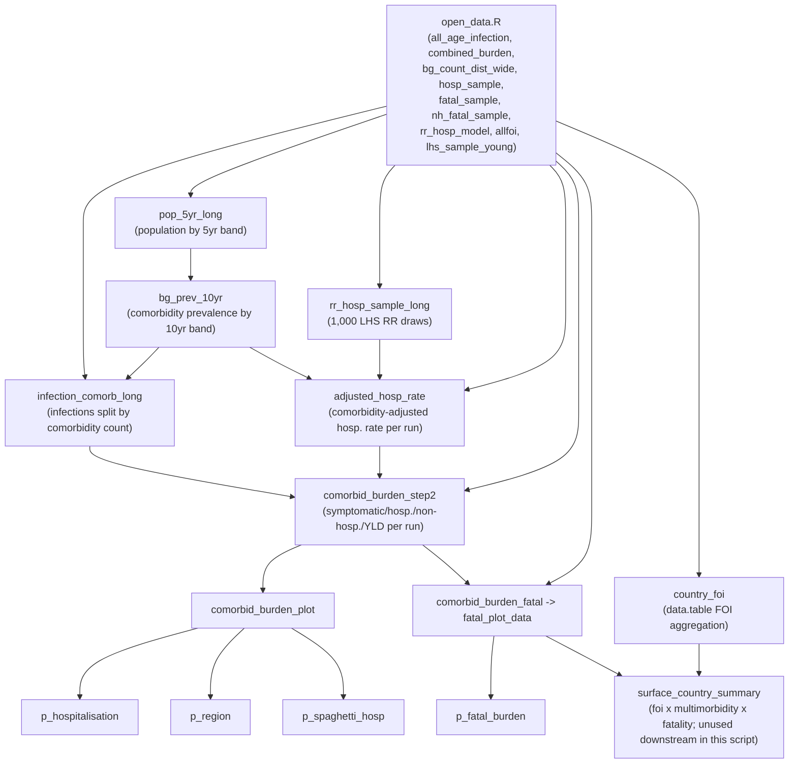

# age_strat_comorb_burden.R — retrospective walkthrough

Written after the fact to document what this script actually does and how the pieces fit together, since it has no header comment and was never explained inline.

## What it does, in one paragraph

Takes country-level chikungunya infection estimates (already split into 10-year age bands) and combines them with (a) background comorbidity prevalence by age/country and (b) literature relative-risk (RR) estimates for hospitalisation by comorbidity count, to produce comorbidity-stratified estimates of symptomatic infections, hospitalisations, non-fatal YLDs, and deaths — each run 1,000 times via Latin Hypercube Sampling (LHS) for uncertainty. It ends with a series of Lancet-style ggplot2 figures, then tacks on an unrelated FOI (force-of-infection) aggregation step at the very end.

## What must already exist before running this script

The script now opens with `source("open_data.R")` (previously it had two bare `load()` calls and assumed everything else was already sitting in the R environment from other scripts run earlier in the same session). `open_data.R` loads every library, sources `Functions/age_strat_subinf_func_final.R` and `Functions/BurdenFunctions_v2.R`, and `load()`s every data object below from `MainData/`:

| Object | Where it comes from |
|---|---|
| `all_age_infection` | `age_strat_burden_estim.R` (or the `Scripts/` copy) — saved to `MainData/all_age_infection.RData` |
| `combined_burden` | `cookie_cut_map.R` (or the `Scripts/` copy) — saved to the repo root as `combined_burden_shrink.RData`, then copied into `MainData/` by hand |
| `bg_count_dist_wide` | An **external** file outside this repo: `../CHIK_MORBID/CHIK_MORBID/01_Data/calc_outputs/bg_count_dist_wide.RData`, normally loaded by scripts like `add_multimorbidity_rr.R` / `integrate_rr_fast.R` — `open_data.R` expects a copy at `MainData/bg_count_dist_wide.RData` (not yet placed there as of 2026-07-14) |
| `hosp_sample`, `fatal_sample`, `nh_fatal_sample`, `le_sample`, `lhs_sample_young`, `lhs_old` | `lhs_samples.R` (root) — saved directly to `MainData/` |
| `calculate_comorbid_burden_step2` (and the now-unused `_step1`) | `Functions/BurdenFunctions_v2.R`, sourced by `open_data.R` |
| `rr_hosp_model` | `MainData/rr_hosp_model.RData` — hand-curated literature RR table, no generating script in this repo |
| `allfoi` | `MainData/allfoi_s1.RData` — produced by an upstream FOI/geostatistical modeling pipeline not visible in this repo |

See `inst.md` for the full script/object dependency diagram.

**Known data-quality issue, not fixed here (lives in a different file):** `lhs_samples.R` defines `fatal_sample` **twice** (once around line 346, once around line 381) with different `qbeta` formulas. Only the *first* definition is ever `save()`d to `MainData/fatal_sample.RData` (line 362) — the second, more carefully age-varying version is computed afterward and silently discarded (never saved, never used again). That means every fatal-burden number this script produces is built from the first, cruder formula (which also reuses the same `C[,5]` draw column for age groups 1–6, rather than a distinct column per group). If the fatality outputs look off, this is the first thing to check in `lhs_samples.R`.

**Practical implication:** if `open_data.R`'s `load()` calls point at files that don't exist yet (e.g. `bg_count_dist_wide.RData` before it's copied into `MainData/`), the script fails immediately and loudly with "cannot open file" — which is safer than the old silent behavior of quietly reusing whatever was left in the R session from an earlier run.

## Object-level data flow inside this script

## Step-by-step

1. **Setup (lines 1–70).** Sources `open_data.R` (which loads all libraries, functions, and data — see above), defines a shared ggplot theme (`theme_lancet_clean`), and defines `age_crosswalk_9` — a 9-row lookup between `group` (1–9), `burden_age_group` (`"[0,10)"` … `"[80,90)"`), 10-year `age_start`/`age_end`, and the coarser 5-band `rr_age_group` (`"0–19"` … `"80+"`) used later to match RR estimates. This crosswalk is now the single source of truth for both mappings (previously the same two mappings were hand-typed via `case_when` in 4 separate places).

2. **Population reshaping (lines ~76–125).** Converts wide 5-year population columns into a long `pop_5yr_long` table keyed by `country` + `age_start`.

3. **Comorbidity prevalence × population (lines ~128–260).** Joins the external comorbidity-prevalence data (`bg_count_dist_wide`) to population, first trying a `country_name` join and then re-doing it on `iso3` once an iso3 crosswalk is available (the `country_name`-keyed version is fully superseded before use — this looked risky on first read but isn't). Note the **France special case** (`iso3 = if_else(country == "France", "FRA", iso3)`): `country_iso3` (derived from `combined_burden`) apparently has no ISO3 for France, so it's patched here rather than at the source. If you see other scripts joining on the same `combined_burden`-derived mapping, France may be broken there too. Ends by collapsing prevalence to 10-year age bands (`bg_prev_10yr`), population-weighted across the underlying finer bands.

4. **Infections by age band × comorbidity (lines ~262–330).** Reshapes total infections into 10-year bands (via a join to `age_crosswalk_9` rather than a hand-written `case_when`), attaches comorbidity prevalence, and splits infections into `infections_comorb_{0,1,2,3+}` by multiplying by prevalence. Also attaches the coarser `rr_age_group` needed to match RR estimates.

5. **RR sampling (lines ~363–424, `sample_rr_lhs`).** For each `rr_age_group × comorbidity` stratum, draws 1,000 LHS samples from a log-normal distribution fit to the RR point estimate and 95% CI (except reference strata where RR is fixed at 1).

6. **Back-calculating an adjusted hospitalisation rate (lines ~426–524).** This is the trickiest part of the script. `hosp_sample` gives a **marginal** (population-average) hospitalisation rate per age band per run — it doesn't know about comorbidity. To split that marginal rate out by comorbidity count, the script: (a) computes `weighted_rr`, the prevalence-weighted average RR across comorbidity strata within an age band (which should reconstruct the marginal rate if the RRs are correct), (b) divides the marginal rate by that weighted RR to back out an implied "reference" (comorbidity-free) rate, then (c) multiplies that reference rate by each stratum's own RR draw to get `adjusted_hosp_rate`. This is now guarded against `weighted_rr == 0` (which previously produced silent `Inf` values that could poison downstream sums without triggering any `NA` filter) — it's coerced to `NA` instead.

7. **Full burden calculation (line ~542, `calculate_comorbid_burden_step2`).** Crosses the country×age×comorbidity infection table against all 1,000 runs, attaches the LHS symptomatic-fraction and clinical-outcome parameters, and computes symptomatic → hospitalised/non-hospitalised → acute/subacute/chronic-duration splits → YLDs. (A near-identical `_step1` used to be called immediately before this and discarded — it was a strict subset of `_step2`'s calculation, computed and never used again; that call has been removed.)

8. **Hospitalisation plots (lines ~589–1123).** Builds `comorbid_burden_plot` (step2 output + population lookup), then produces, from filtered/aggregated versions of the same table: a global age×comorbidity plot (`p_hospitalisation`), a region-faceted version (`p_region`), and a "spaghetti" plot of all countries plus the global median/CI (`p_spaghetti_hosp`). These three blocks (plus two more below) repeat the same filter → factor → group-and-sum → group-and-summarise(median/CI) pattern with only the grouping keys changed — a good future candidate for a shared helper function, not changed in this pass since it's a larger refactor.

9. **Fatal burden (lines ~1137–1355).** Applies `fatal_sample`/`nh_fatal_sample` (hospitalised/non-hospitalised fatality rates by age band) to the step2 output to get deaths, then builds `p_fatal_burden` the same way as the hospitalisation plots. See the "known data-quality issue" callout above — the `fatal_sample` values used here come from the cruder of two formulas defined in `lhs_samples.R`.

10. **FOI aggregation (lines ~1358+, unrelated tangent).** Switches to `data.table` to compute a population-weighted country-level FOI (median + 95% CI across ~100 FOI draw columns) from `allfoi`, then merges it with the fatal-burden output into `surface_country_summary` — a country × broad-age-group table of FOI, multimorbidity prevalence, and fatality rate. This final object is **not plotted anywhere in this script**; it looks like an input prepared for a bubble/surface plot built elsewhere.

## What changed in this review pass

Applied (low-risk, verified by inspection — no R available in this environment to re-run and diff outputs, so treat as reviewed-not-executed):
- Removed the dead `comorbid_burden_step1` call (the single most expensive redundant computation in the file).
- Added `relationship = "many-to-one"` to two `country`-keyed joins that had no cardinality guard (would have silently duplicated rows if a country ever mapped to >1 iso3).
- Guarded `adjusted_hosp_rate` against divide-by-zero producing silent `Inf`/`-Inf` that could poison global sums without tripping an `is.na()` filter.
- Collapsed 4 hand-written `case_when` blocks (2 age-band mappings × 2 locations each) into joins against `age_crosswalk_9`, which now carries both mappings.

Deferred (bigger wins, but need to be tested in R before trusting — not applied here):
- Rewrite `calculate_comorbid_burden_step2`'s `tidyr::crossing()` + sequential `dplyr` joins in `data.table` (the script already proves this pattern elsewhere for a much smaller step).
- Vectorize the `country_foi` `rowwise()`/`c_across()` computation (e.g. `matrixStats::rowMedians`/`rowQuantiles`).
- Consolidate the 5–6 near-identical plot-data-prep blocks into one parameterized helper.
- Fix the France iso3 mapping at its source (`combined_burden`) rather than patching it in this script.
