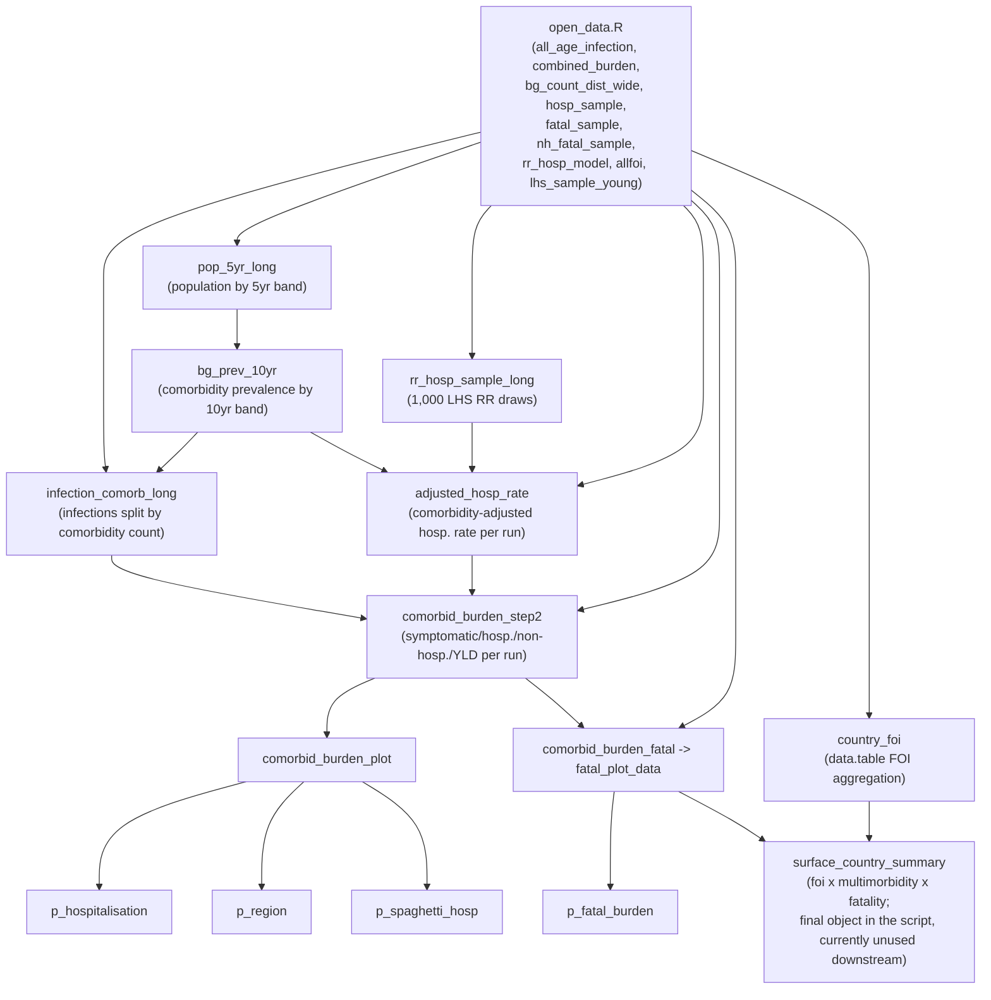

# age_strat_comorb_burden.R — analysis plan and retrospective walkthrough

Written after the fact to document what this script actually does, why, and how the pieces fit together, since it has no header comment and was never explained inline.

## Analysis plan

**Objective.** Estimate the comorbidity-stratified clinical burden of chikungunya (symptomatic infections, hospitalisations, non-fatal health loss (YLDs), and deaths) by country and 10-year age band, propagating parameter uncertainty throughout via a 1,000-run Latin Hypercube Sample (LHS).

**Population and unit of analysis.** All countries with chikungunya infection estimates (from the wider FOI/burden-mapping pipeline), stratified by 10-year age band (0–9 … 70–79; the 80+ band is dropped from most outputs, see `group_number <= 8` filters) and comorbidity count (0, 1, 2, 3+).

**Data sources.**
1. Country/age-specific total infection estimates (`all_age_infection`, from the FOI-mapping pipeline).
2. Background comorbidity prevalence by country and age (`bg_count_dist_wide`, an external dataset from a sibling project, `CHIK_MORBID`).
3. Literature-derived relative risk (RR) of hospitalisation by comorbidity count and broad age band (`rr_hosp_model`, hand-curated, 5 age bands: 0–19, 20–39, 40–59, 60–79, 80+).
4. Marginal (population-average, comorbidity-blind) hospitalisation, fatality, and clinical-course parameters, each sampled 1,000 times via LHS in `lhs_samples.R` (`hosp_sample`, `fatal_sample`, `nh_fatal_sample`, `lhs_sample_young`).

**Method, in sequence** (see the step-by-step below for the code-level detail):
1. Harmonise all data sources onto a common country (iso3) × 10-year age band key.
2. Split total infections into comorbidity-count strata using comorbidity prevalence (infections × prevalence — this assumes comorbidity status doesn't affect infection risk itself, only clinical outcome once infected).
3. Sample 1,000 LHS draws of the hospitalisation RR for each age band × comorbidity stratum from a log-normal distribution fit to each RR's point estimate and 95% CI.
4. Because the available hospitalisation-rate data (`hosp_sample`) is a single population-average rate per age band with no comorbidity breakdown, back-calculate a comorbidity-specific rate: divide the marginal rate by the prevalence-weighted average RR within that age band (which should reconstruct the marginal rate if the RRs are internally consistent) to get an implied comorbidity-free reference rate, then scale that reference rate by each stratum's own RR draw.
5. Apply symptomatic-fraction, hospitalisation, and clinical-course (acute/subacute/chronic-duration) splits, run 1,000 times, to get symptomatic/hospitalised/non-hospitalised counts and YLDs per country × age × comorbidity × run.
6. Apply fatality rates (hospitalised and non-hospitalised) to the same table to get deaths.
7. Summarise across the 1,000 runs (median + 95% quantile interval) at several levels — global, region-faceted, per-country, and combined with a country-level force-of-infection (FOI) summary — for reporting/visualisation.

**Outputs.** Four ggplot2 figures (`p_hospitalisation`, `p_region`, `p_spaghetti_hosp`, `p_fatal_burden`) and one unconsumed summary table (`surface_country_summary` — see the "Object-level data flow" section for why that one is currently a dead end).

**Key methodological assumption worth flagging:** step 4 above is the single most consequential modelling choice in this script — it assumes the literature RRs are consistent enough with the observed marginal hospitalisation rate that "back-solving" for a reference rate is meaningful. If the RR estimates and the marginal rate come from different populations/time periods, this back-calculation can silently produce reference rates that are too high or too low (see the `is.finite()` guard added below, which catches the extreme case but not a merely-biased one).

## What must already exist before running this script

The script opens with `source("open_data.R")`. `open_data.R` loads libraries, sources `Functions/age_strat_subinf_func_final.R` and `Functions/BurdenFunctions_v2.R`, and `load()`s every data object below from `MainData/`:

| Object | Where it comes from |
|---|---|
| `all_age_infection` | `age_strat_burden_estim.R` (or the `Scripts/` copy) — saved to `MainData/all_age_infection.RData` |
| `combined_burden` | `cookie_cut_map.R` (or the `Scripts/` copy) — saved to the repo root as `combined_burden_shrink.RData`, then copied into `MainData/` by hand |
| `bg_count_dist_wide` | An **external** file outside this repo: `../CHIK_MORBID/CHIK_MORBID/01_Data/calc_outputs/bg_count_dist_wide.RData`, normally loaded by scripts like `add_multimorbidity_rr.R` / `integrate_rr_fast.R` — `open_data.R` expects a copy at `MainData/bg_count_dist_wide.RData` (not yet placed there as of 2026-07-14) |
| `le_sample`, `lhs_sample_young`, `lhs_old` | `lhs_samples.R` (root) — saved directly to `MainData/`, unchanged |
| `hosp_sample`, `fatal_sample` | `lhs_updated.R` (root, new 2026-07-15) — saved as `MainData/hosp_sample_v2.RData`/`fatal_sample_v2.RData`, re-derived from raw count data (`MainData/hosp_chikvna.RDS`, `MainData/death_chikvna.RDS`) via exact binomial variance per age band |
| `nh_fatal_sample` | `lhs_updated.R` — saved as `MainData/nh_fatal_sample_v2.RData`, still built from the CV-carryover approach against `MainData/chikv_fatal_hosp_rate.RData`'s point estimates (no non-hospitalised death count data exists yet) |
| `calculate_comorbid_burden_step2` | `Functions/BurdenFunctions_v2.R`, sourced by `open_data.R` |
| `rr_hosp_model` | `MainData/rr_hosp_model.RData` — hand-curated literature RR table, no generating script in this repo |
| `allfoi` | `MainData/allfoi_s1.RData` — produced by an upstream FOI/geostatistical modeling pipeline not visible in this repo |

See `inst.md` for the full script/object dependency diagram.

**Superseded data-quality issue (as of 2026-07-15):** `lhs_samples.R` still defines `fatal_sample` **twice** (once around line 346, once around line 381) with different `qbeta` formulas, and only the first (cruder) definition is ever `save()`d to `MainData/fatal_sample.RData`. This bug is now **moot for the live pipeline** — `open_data.R` loads `fatal_sample_v2.RData` from `lhs_updated.R` instead, which derives `fatal_sample` from real in-hospital death counts (`MainData/death_chikvna.RDS`) via exact binomial variance, not from either of `lhs_samples.R`'s formulas. The bug still exists in `lhs_samples.R` itself if that script is ever run directly for some other purpose.

**Practical implication:** if `open_data.R`'s `load()` calls point at files that don't exist yet (e.g. `bg_count_dist_wide.RData` before it's copied into `MainData/`), the script fails immediately and loudly with "cannot open file" — which is safer than the old silent behavior of quietly reusing whatever was left in the R session from an earlier run.

## Object-level data flow inside this script

`surface_country_summary` is drawn with a distinct label because — as of this review pass — nothing in this script or elsewhere in the repo reads it. The FOI-aggregation branch (`country_foi`) exists specifically to feed that final merge, so if you don't have another script consuming `surface_country_summary`, that whole branch is currently effort with no downstream payoff. It's not wrong, just currently a dead end — worth wiring up (a save/write step, or a bubble/surface plot) if it's meant to go somewhere.

## Step-by-step

1. **Setup (lines 1–70).** Sources `open_data.R` (which loads all libraries, functions, and data — see above), defines a shared ggplot theme (`theme_lancet_clean`), and defines `age_crosswalk_9` — a 9-row lookup between `group` (1–9), `burden_age_group` (`"[0,10)"` … `"[80,90)"`), 10-year `age_start`/`age_end`, and the coarser 5-band `rr_age_group` (`"0–19"` … `"80+"`) used later to match RR estimates. This crosswalk is the single source of truth for both mappings (previously the same two mappings were hand-typed via `case_when` in 4 separate places, now collapsed into joins).

2. **Population reshaping (lines ~76–125).** Converts wide 5-year population columns (`all_age_infection`'s numbered age columns `1`…`18`) into a long `pop_5yr_long` table keyed by `country` + `age_start`, one row per 5-year age band.

3. **Comorbidity prevalence × population (lines ~128–225).** Joins the external comorbidity-prevalence data (`bg_count_dist_wide`) to population on `iso3` + `age_start` (an earlier country-name-keyed attempt was removed in this pass — see below). `missing_from_bg` is a diagnostic print (not used further) listing countries present in `all_age_infection` but absent from the comorbidity data — worth checking if that list is non-empty, since those countries will have `NA` comorbidity prevalence for the rest of the pipeline. Note the **France special case** (`iso3 = if_else(country == "France", "FRA", iso3)`): `country_iso3` (derived from `combined_burden`) apparently has no ISO3 for France, so it's patched here rather than at the source. If you see other scripts joining on the same `combined_burden`-derived mapping, France may be broken there too. Ends by collapsing prevalence to 10-year age bands (`bg_prev_10yr`), population-weighted across the underlying 5-year bands.

4. **Infections by age band × comorbidity (lines ~245–305).** Reshapes total infections into 10-year bands (via a join to `age_crosswalk_9`), attaches comorbidity prevalence, and splits infections into `infections_comorb_{0,1,2,3+}` by multiplying by prevalence (this is the step 2 "assumption" flagged in the analysis plan above — comorbidity status doesn't change infection risk, only what happens after infection). Also attaches the coarser `rr_age_group` needed to match RR estimates. `rr_hosp_model_unique` deduplicates the RR table to one row per `rr_age_group` × `comorbidity` combination (`.keep_all = TRUE` silently keeps whichever row appears first if the source table ever has duplicates — worth a sanity check if `rr_hosp_model` is ever regenerated).

5. **RR sampling (lines ~335–420, `sample_rr_lhs`).** For each `rr_age_group × comorbidity` stratum, draws 1,000 LHS samples from a log-normal distribution fit to the RR point estimate and 95% CI (except reference strata where RR is fixed at 1, since a comorbidity-free group's own RR relative to itself is 1 by definition).

6. **Back-calculating an adjusted hospitalisation rate (lines ~422–520).** This is the trickiest and most consequential part of the script (see the analysis plan's flagged assumption). `hosp_sample` gives a **marginal** (population-average) hospitalisation rate per age band per run — it doesn't know about comorbidity. `prev_rr_long` (a many-to-many join of prevalence and RR draws by `rr_age_group`/`comorbidity`) and `hosp_sample_long`/`prev_rr_hosp_long` assemble everything needed per country/age/comorbidity/run. Then: (a) `weighted_rr` is the prevalence-weighted average RR across comorbidity strata within an age band (which should reconstruct the marginal rate if the RRs are correct), (b) `hosp_rate_reference` divides the marginal rate by that weighted RR to back out an implied "reference" (comorbidity-free) rate, then (c) `adjusted_hosp_rate` multiplies that reference rate by each stratum's own RR draw. This is guarded against `weighted_rr == 0` (which previously produced silent `Inf` values that could poison downstream sums without triggering any `NA` filter) — it's coerced to `NA` instead. `analysis_iso3`/`adjusted_hosp_rate_103` then restrict to the ~103 countries actually present in `all_age_infection`.

7. **Full burden calculation (line ~510, `calculate_comorbid_burden_step2`).** Crosses the country×age×comorbidity infection table against all 1,000 runs, attaches the LHS symptomatic-fraction and clinical-outcome parameters, and computes symptomatic → hospitalised/non-hospitalised → acute/subacute/chronic-duration splits → YLDs (see `Functions/BurdenFunctions_v2.R` for the DALY-style duration × disability-weight arithmetic).

8. **Hospitalisation plots (lines ~525–1090).** Builds `comorbid_burden_plot` (step2 output + population lookup via `population_lookup`, `age_levels`/`comorb_levels` fix the factor ordering for plotting, `comorb_colours` is the shared Lancet-style palette), then produces, from filtered/aggregated versions of the same table: a global age×comorbidity plot (`p_hospitalisation`, now printed), a region-faceted version (`p_region`), and a "spaghetti" plot of all countries plus the global median/CI (`p_spaghetti_hosp`). These three blocks (plus two more below) repeat the same filter → factor → group-and-sum → group-and-summarise(median/CI) pattern with only the grouping keys changed — a good future candidate for a shared helper function, not changed in this pass since it's a larger refactor.

9. **Fatal burden (lines ~1095–1310).** Applies `fatal_sample`/`nh_fatal_sample` (hospitalised/non-hospitalised fatality rates by age band) to the step2 output to get deaths, then builds `p_fatal_burden` the same way as the hospitalisation plots. As of 2026-07-15, `fatal_sample` comes from `lhs_updated.R`'s binomial-variance derivation (real in-hospital death counts), not `lhs_samples.R`'s old hardcoded formulas — see the "superseded data-quality issue" callout above.

10. **FOI aggregation (lines ~1315+, a separate computation from the burden work above).** Switches to `data.table` to compute a population-weighted country-level FOI (median + 95% CI across ~100 FOI draw columns, now vectorized via `apply()` on a matrix instead of `dplyr::rowwise()`) from `allfoi`, then merges it with the fatal-burden output into `surface_country_summary` — a country × broad-age-group table of FOI, multimorbidity prevalence, and fatality rate. As noted above, this final object is currently unused downstream in this script.

## What changed across both review passes

**Pass 1 (correctness + first efficiency pass):**
- Removed the dead `comorbid_burden_step1` call (a full redundant Monte Carlo computation, never used).
- Added `relationship = "many-to-one"` to two `country`-keyed joins that had no cardinality guard.
- Guarded `adjusted_hosp_rate` against divide-by-zero producing silent `Inf`/`-Inf`.
- Collapsed 4 hand-written `case_when` blocks into joins against `age_crosswalk_9`.

**Pass 2 (cross-check):**
- Removed a redundant `bg_count_with_pop` join keyed on `country_name` that was unconditionally overwritten before ever being read.
- Removed 4 more dead objects that were computed and never used again: `bg_count_dist_analysis`, `bg_regional_prev`, `infection_comorb_rr`, `prev_comorb_long_103`.
- Vectorized `country_foi`'s median/quantile computation (matrix + `apply()` instead of `dplyr::rowwise()`/`c_across()`).
- Added the missing `print(p_hospitalisation)` so it's actually shown, matching its sibling plots.
- Flagged (comment only) that `surface_country_summary` is the final, currently-unconsumed output of the script.

All of the above were verified by careful reading and cross-checked independently (a second pass re-confirmed each dead-object claim via grep before removal) — there is still no R installed in this environment to execute and diff outputs, so treat this as reviewed-not-executed and re-run the full pipeline yourself before trusting the numbers for anything downstream.

**Still deferred (bigger, riskier rewrites — not applied):**
- Rewrite `calculate_comorbid_burden_step2`'s `tidyr::crossing()` + sequential `dplyr` joins in `data.table` (the single most expensive step in the pipeline).
- Consolidate the 5–6 near-identical plot-data-prep blocks into one parameterized helper.
- Fix the France iso3 mapping at its source (`combined_burden`) rather than patching it in this script.
- `lhs_samples.R`'s `fatal_sample` double-definition bug is superseded for this pipeline (see callout above) but still exists in `lhs_samples.R` itself if that script is run directly elsewhere.
- Get real non-hospitalised death count data so `nh_fatal_sample` can move off the CV-carryover approach onto the same exact binomial-variance treatment as `hosp_sample`/`fatal_sample`.
