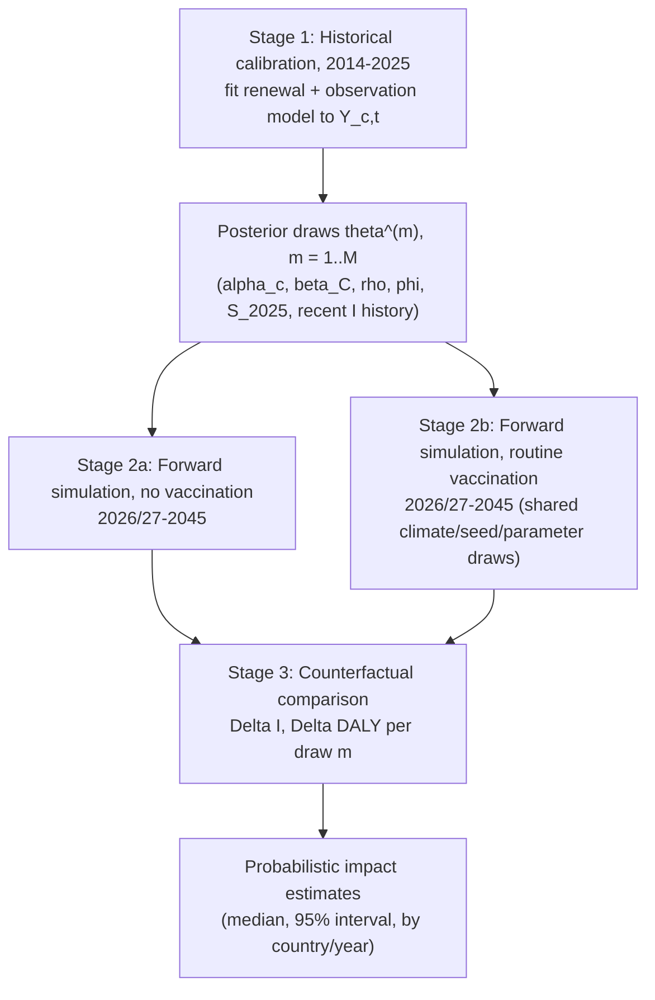

# Modelling the Impact of Routine Immunisation against Chikungunya across Latin American Countries: A Climate-Informed Semi-Mechanistic Stochastic Renewal State-Space Model

*Working proposal draft*

---

## 1. Overview

Chikungunya transmission across Latin America is shaped by two forces that operate on very
different time scales: fast, climate-modulated transmissibility within a season, and slow,
multi-year depletion and replenishment of the susceptible pool through infection, births, and
population turnover. This proposal describes a **climate-informed, semi-mechanistic stochastic
renewal state-space model** that couples these two processes to (i) reconstruct historical
transmission dynamics from surveillance data (2014–2025), and (ii) generate probabilistic,
climate-driven projections of future transmission (2026/2027–2045) under routine-immunisation
and no-vaccination scenarios, so that the population-level impact of a chikungunya vaccination
programme can be estimated as a counterfactual comparison between two coupled stochastic
futures.

The model is semi-mechanistic: the renewal equation and susceptible-depletion accounting are
mechanistic, while transmissibility itself is modelled statistically as a function of climate
suitability rather than derived from a fully mechanistic vector-borne transmission model. This
keeps the parameter set identifiable from monthly case counts alone while retaining the causal
structure needed for scenario projection (susceptibility depletion, climate seasonality,
vaccine-induced immunity).

---

## 2. Objectives

**Primary objective.** Estimate the counterfactual reduction in chikungunya infections,
symptomatic cases, and disease burden (e.g. DALYs) attributable to routine immunisation across
Latin American countries between 2026/2027 and 2045, under uncertainty propagated from both
historical calibration and future climate and demographic trajectories.

**Secondary objectives**

1. Reconstruct country-level transmissibility ($R_{0}$, $R_{\text{eff}}$) and susceptibility
   trajectories for 2014–2025 from surveillance data and climate covariates.
2. Quantify how climate suitability modulates transmission potential across countries with
   heterogeneous epidemiological histories.
3. Generate probabilistic (ensemble) projections of outbreak timing, size, and recurrence under
   a no-vaccination baseline.
4. Compare routine-immunisation strategies (introduction age, coverage, catch-up) against the
   no-vaccination baseline using paired stochastic simulation.
5. Characterise which countries/parameters are poorly identified by current data, to prioritise
   future data collection.

---

## 3. Data Sources

| Component | Source | Status |
|---|---|---|
| Multi-country introduction/outbreak-year history | `Data/chikungunya_intro_years_model_ready_updated.xlsx` (consumed by `country_specific_susceptible_model.R`) | Available — candidate source for the historical outbreak-year indicator series needed to fit §5's hierarchical $\alpha_c$ |
| Multi-country FOI / seroprevalence posterior | `MainData/foi_comb_all_0707.RData` (`allfoi_s1.RData`) | Available (large, gitignored) — candidate prior for initial susceptibility, $S_{c,2014}$ |
| Country-specific susceptibility modelling | `country_specific_susceptible_model.R`, `country_specific_sus_graph.R` | Available |
| At-risk / focal population by country | `Data/global_all_atrisk.csv`, `Data/global_all_focal.csv` | Available |
| Age-stratified burden and infection estimation, PSA | `age_strat_burden_estim_atrisk.R`, `chikmap_psa_final.R` | Available — provides the severity/reporting cascade needed to convert $I_{c,t}$ into cases, hospitalisations, deaths, DALYs |
| Monthly case time series (needed to fit the renewal likelihood, §5) | Not currently in this repo; a Brazil SINAN monthly pipeline exists in the sibling `CHIK_CLIM` project | **To be acquired** for non-Brazil countries; Brazil can pilot the renewal fit using `CHIK_CLIM`'s existing SINAN extraction |
| Historical monthly climate covariates, by country | Not currently in this repo; `CHIK_CLIM` has Brazil-only municipal climate (TerraClimate/WorldClim) | **To be acquired/extended** to country level |
| Future climate projections (CMIP6) | Not currently in this repo; `CHIK_CLIM` has a Brazil-scoped WorldClim CMIP6 fetch | **To be acquired/extended** to country level |
| Vaccination coverage, schedule, efficacy, waning | Programme assumptions / trial data | **To be defined** per scenario; efficacy and waning priors to be sourced from published vaccine trial data once a product/schedule is specified |

Countries without their own case time series are not excluded: they enter the hierarchical
transmissibility prior ($\alpha_c$, see §5.2) with wide uncertainty informed by the multi-country
FOI dataset already assembled in this repo, and their projections carry correspondingly wider
intervals. This is the same partial-pooling logic already implicit in
`country_specific_susceptible_model.R`'s per-country lookup table, made explicit and probabilistic.

---

## 4. Model Structure at a Glance

The pipeline has three stages: (1) fit the model to historical monthly cases to obtain a joint
posterior over transmission parameters and 2025 latent states; (2) roll that posterior forward
under two scenarios that share every source of external randomness except vaccination; (3)
difference the two scenario ensembles, draw by draw, to obtain the vaccine-attributable impact.

---

## 5. Stage 1 — Historical Calibration (2014–2025)

For country $c$ and month $t \in \{2014, \dots, 2025\}$, let $Y_{c,t}$ denote observed
(reported) cases and $C_{c,t}$ a climate-suitability covariate (e.g. temperature- and
precipitation-derived vectorial capacity index).

### 5.1 Transmission model

Country-specific baseline transmissibility $\alpha_c$ and a shared climate effect $\beta_C$
determine the basic reproduction number in month $t$:

$$
R_{0,c,t} = \exp\left(\alpha_c + \beta_C\, C_{c,t}\right)
$$

Susceptible depletion scales this down to an effective reproduction number:

$$
R_{\text{eff},c,t} = R_{0,c,t}\, \frac{S_{c,t}}{N_{c,t}}
$$

where $S_{c,t}$ is the latent susceptible population and $N_{c,t}$ the total population.

### 5.2 Renewal (latent infection) process

New infections follow a discrete-time renewal process with generation-interval weights
$w_g$ ($g = 1, \dots, G$; $\sum_g w_g = 1$):

$$
I_{c,t} \sim \text{NegBin}\left(R_{\text{eff},c,t} \sum_{g=1}^{G} w_g\, I_{c,t-g},\ \phi\right)
$$

### 5.3 Observation model

Reported cases are a downsampled, overdispersed observation of true infections through a
reporting rate $\rho_c$:

$$
Y_{c,t} \mid I_{c,t} \sim \text{NegBin}\left(\rho_c\, I_{c,t},\ \phi\right)
$$

### 5.4 Susceptible-state update

$$
S_{c,t+1} = S_{c,t} - I_{c,t} + B_{c,t} - D_{c,t}
$$

with $B_{c,t}$ births entering the susceptible pool and $D_{c,t}$ deaths/ageing-out of
previously susceptible or immune individuals (age-structured demography as in the companion
cohort model; see §12).

### 5.5 Priors and hierarchical pooling

$\alpha_c \sim \mathcal{N}(\mu_\alpha, \sigma_\alpha^2)$ across countries, with $\mu_\alpha,
\sigma_\alpha$ estimated jointly (partial pooling). Countries with long, complete surveillance
histories are dominated by their own data; countries with short or absent histories are pulled
toward the regional mean and additionally informed by the mFOI prior from `chik_foi.csv`.
$\beta_C$ is shared across countries (pooled climate effect), optionally with a
country-level random slope if the data support it.

Fitting this stage to 2014–2025 case counts yields a joint posterior over
$\{\alpha_c, \beta_C, \rho_c, \phi\}$ and over every latent trajectory
$\{I_{c,t}, S_{c,t}, R_{0,c,t}, R_{\text{eff},c,t}\}_{t=2014}^{2025}$.

---

## 6. Transferring Posterior Uncertainty into the Projection

The end of the calibration window is not summarised by a point estimate. For each posterior
draw $m = 1, \dots, M$ (e.g. $M = 5{,}000$), the full parameter and state vector is carried
forward as the initial condition of the future simulation:

$$
\theta_c^{(m)} = \left\{ \alpha_c^{(m)},\ \beta_C^{(m)},\ \rho_c^{(m)},\ \phi^{(m)},\
S_{c,2025}^{(m)},\ I_{c,2025-K:2025}^{(m)} \right\}
$$

where $I_{c,2025-K:2025}^{(m)}$ is the last $K$ months of infection history required to seed the
renewal sum $\sum_g w_g I_{c,t-g}$ once the simulation moves past 2025. Running $M$ independent
forward simulations, one per posterior draw, is what propagates *calibration uncertainty* into
the projection — this is distinct from, and additional to, the process (stochastic) uncertainty
generated within each forward simulation itself.

---

## 7. Stage 2 — Future Forward Simulation (2026/2027–2045)

For each posterior draw $m$ and each future month $t$, the following steps are applied in
sequence.

**① Future climate input.** $C_{c,t}^{\text{future}}$ is obtained either by block-resampling
historical seasonal climate (capturing observed inter-annual variability with no assumed trend)
or by drawing from CMIP6 projections (a Brazil-scoped CMIP6 fetch already exists in the sibling
`CHIK_CLIM` project and would need extending to the full country set). Both should be run as
alternative climate arms.

**② Reproduction number.**

$$
R_{0,c,t}^{(m)} = \exp\left(\alpha_c^{(m)} + \beta_C^{(m)}\, C_{c,t}^{\text{future}}\right)
$$

**③ Effective reproduction number, given current susceptibility.**

$$
R_{\text{eff},c,t}^{(m)} = R_{0,c,t}^{(m)}\, \frac{S_{c,t}^{(m)}}{N_{c,t}}
$$

**④ Importation / seeding.**

$$
M_{c,t}^{(m)} \sim \text{Seeding process (e.g. Poisson}(\lambda_{c,t})\text{)}
$$

representing travel-linked introductions, small enough to matter only when local transmission is
nearly extinct.

**⑤ New infections.**

$$
I_{c,t}^{(m)} \sim \text{NegBin}\left(R_{\text{eff},c,t}^{(m)} \sum_{g=1}^{G} w_g\, I_{c,t-g}^{(m)} + M_{c,t}^{(m)},\ \phi^{(m)}\right)
$$

**⑥ Susceptible update.**

$$
S_{c,t+1}^{(m)} = S_{c,t}^{(m)} - I_{c,t}^{(m)} + B_{c,t} - D_{c,t}
$$

Iterating ①–⑥ from the first projection month through 2045 produces one stochastic future
trajectory for draw $m$.

---

## 8. Ensemble Interpretation

Repeating Stage 2 across all $M$ posterior draws (and, within each draw, across the intrinsic
stochasticity of steps ④–⑤) produces an ensemble of futures rather than a single forecast:

$$
I_{c,t}^{(1)},\ I_{c,t}^{(2)},\ \dots,\ I_{c,t}^{(M)}
$$

Some trajectories show a large outbreak in 2028, others in 2033, others several smaller
outbreaks, others none through 2045. From this ensemble the following can be computed directly,
per country and per year:

- Outbreak probability (probability a substantial epidemic occurs in a given year)
- Number of outbreaks over the projection horizon
- Time to first outbreak
- Outbreak size distribution
- Cumulative infections, 2027–2045
- Susceptible proportion at 2045
- Cumulative cases, hospitalisations, deaths, DALYs (via severity/reporting cascades applied to
  $I_{c,t}$)

A trajectory generated this way is, on its own, still a single-scenario projection (a
*baseline* if no vaccination is included, or an *intervention projection* if it is). It becomes
a counterfactual only once paired against an alternative scenario, as described next.

---

## 9. Stage 3 — Counterfactual Scenario Comparison

**Scenario A — No vaccination.**

$$
S_{c,t+1}^{\text{NV}} = S_{c,t}^{\text{NV}} - I_{c,t}^{\text{NV}} + B_{c,t} - D_{c,t}
$$

**Scenario B — Routine vaccination.**

$$
S_{c,t+1}^{\text{V}} = S_{c,t}^{\text{V}} - I_{c,t}^{\text{V}} - V_{c,t} + B_{c,t} - D_{c,t}
$$

where $V_{c,t}$ is the number of individuals removed from the susceptible pool by vaccination in
month $t$ (target-age cohort size $\times$ coverage $\times$ vaccine efficacy, with waning
returning a fraction of previously protected individuals to $S$ over time; see the companion
age-structured cohort model for the full dose/waning accounting).

**Coupling.** For each posterior draw $m$, Scenarios A and B are run with **identical**
external randomness: the same future climate trajectory $C_{c,t}^{\text{future}}$, the same
importation events $M_{c,t}^{(m)}$, the same demographic trajectory ($B_{c,t}, D_{c,t}$), and
the same transmission-parameter draw $\theta_c^{(m)}$. This is the standard *common random
numbers* technique: because both arms face the same otherwise-random future, the only source of
divergence between them is vaccine-induced susceptibility removal, which sharply reduces Monte
Carlo noise in the estimated impact relative to comparing independently-simulated arms.

**Impact metrics**, computed per draw and then summarised across draws (median, 95% interval):

$$
\Delta I_c^{(m)} = \sum_{t} I_{c,t}^{\text{NV},(m)} - \sum_{t} I_{c,t}^{\text{V},(m)}
$$

$$
\Delta \text{DALY}_c^{(m)} = \text{DALY}_c^{\text{NV},(m)} - \text{DALY}_c^{\text{V},(m)}
$$

or, generically, for any outcome of interest:

$$
\text{Impact}_c^{(m)} = \text{Outcome}_{c}^{\text{NV},(m)} - \text{Outcome}_{c}^{\text{V},(m)}
$$

---

## 10. Validation Strategy

Fitting Stage 1 to the full 2014–2025 window and projecting immediately afterwards leaves no
out-of-sample check on predictive performance. A staged, defensible approach is used instead:

| Step | Data used | Purpose |
|---|---|---|
| 1. Training fit | 2014–2022/2023 | Estimate parameters and latent states |
| 2. Hindcast validation | 2023/24–2025 (held out) | Compare forecast vs. observed cases; assess calibration of predictive intervals |
| 3. Final refit | 2014–2025 (full) | Re-estimate parameters using all available historical data, once validation performance is acceptable |
| 4. Forward projection | 2026/2027–2045 | Generate baseline and vaccination-scenario ensembles from the final-refit posterior |

Validation metrics should include probabilistic scoring (e.g. CRPS, coverage of prediction
intervals) rather than point-forecast error alone, since the model's primary output is a
distribution of futures, not a single trajectory.

---

## 11. Outputs

- Country-level posterior trajectories of $R_{0}$, $R_{\text{eff}}$, and susceptibility,
  2014–2025.
- Probabilistic baseline projections (outbreak timing, size, recurrence), 2026/2027–2045.
- Probabilistic vaccination-scenario projections under alternative introduction ages, coverage
  levels, and catch-up designs.
- Counterfactual impact estimates (infections, cases, DALYs averted) with uncertainty intervals,
  by country and by year.
- A ranked assessment of which countries' estimates are calibration-driven versus prior-driven,
  to flag where additional surveillance data would most reduce uncertainty.

---

## 12. Feasibility Considerations and Limitations

- **Geographic/administrative unit.** The renewal model is specified at country level ($c$),
  matching a genuine multi-country Latin American analysis and this repo's existing
  country-level susceptibility/FOI infrastructure. Where only subnational (state/UF) monthly
  case data exist — currently the case for Brazil, via the sibling `CHIK_CLIM` SINAN pipeline —
  the same structure applies with $c$ = state for that country, and national-level rollups are
  obtained by aggregation.
- **Heterogeneous data availability.** Most countries will have short or no monthly case time
  series suitable for fitting the renewal likelihood directly. These are handled through the
  hierarchical prior on $\alpha_c$ and the FOI/introduction-history-informed prior on initial
  susceptibility (§3, §5.5) rather than excluded, but their projections should be reported with
  visibly wider uncertainty and flagged as prior-dominated rather than data-driven.
- **Identifiability.** $\alpha_c$, $\beta_C$, $\rho_c$, and $\phi$ are jointly estimated from
  case counts alone in countries with limited history; weak identifiability is expected for
  short series with few outbreak events. Mitigations: shared/pooled $\beta_C$ across countries,
  informative priors from the FOI/seroprevalence dataset already assembled in this repo
  (`MainData/foi_comb_all_0707.RData`), and reporting-model priors informed by whatever
  under-ascertainment evidence is available per country.
- **Vaccine profile uncertainty.** Efficacy, waning duration, and achievable coverage are
  currently placeholders and should be treated as a separate uncertain input, ideally varied in
  sensitivity analysis rather than fixed at point values.
- **Computation.** Stage 1 (historical calibration) is a latent-state renewal model best fit in
  a probabilistic programming framework (e.g. Stan) using either full Bayesian inference or a
  particle MCMC/particle filter approach if the state-space likelihood is not analytically
  tractable. Stage 2–3 (forward simulation and scenario comparison) is comparatively cheap — a
  pure forward simulation over $M$ draws with no further inference — and is straightforward to
  parallelise across countries and draws.
- **Relationship to the companion age-structured cohort model.** This renewal model handles
  short-timescale, climate-driven transmission dynamics and aggregate susceptibility. It is
  compatible with, and can supply the aggregate infection/susceptibility trajectory to, the
  separately proposed age-structured cohort model, which resolves *within-year* age-specific
  exposure, routine/catch-up vaccination bookkeeping, and long-run demographic change. The two
  are complementary rather than competing: the renewal model determines *when and how large* an
  epidemic is; the cohort model determines *who* is infected and *how immunity carries forward*
  across years and age groups.

---

## 13. Next Steps

1. Assemble the country-level case time series and covariates needed for Stage 1 (start with
   Brazil, where a monthly SINAN pipeline already exists in `CHIK_CLIM`; scope data availability
   for the remaining priority countries using this repo's existing FOI/introduction-year assets).
2. Implement the Stage 1 renewal + observation model in Stan as a time-series renewal
   likelihood, reusing this repo's country-level susceptibility priors
   (`country_specific_susceptible_model.R`) as a starting point for $S_{c,2014}$.
3. Run the training/hindcast/refit validation sequence (§10) on Brazil first, as a proof of
   concept, before extending to the full country set.
4. Implement Stage 2–3 as a forward-simulation module consuming Stage 1 posterior draws,
   following the common-random-numbers coupling in §9.
5. Define the initial set of vaccination scenarios (introduction age, coverage, catch-up) in
   consultation with programme/policy stakeholders.
