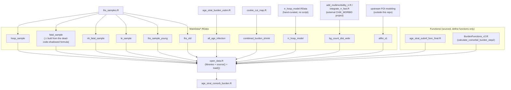

# chik_mapping

R project estimating global chikungunya (CHIKV) burden: force-of-infection (FOI) mapping, age-stratified infection/burden estimation, probabilistic sensitivity analysis (PSA), and relative-risk (RR) adjustment for multimorbidity, feeding into burden maps and at-risk population estimates.

## Layout

- Root: standalone analysis scripts (`chikmap_psa_final.R`, `foi_map.R`, `age_strat_burden*.R`, `cookie_cut_map.R`, `SpatialBlockBootstrap_v3.R`, RR-integration scripts, etc.) plus explanatory markdown docs (`ANALYSIS_*.md`, `IMPLEMENTATION_*.md`, `RR_INTEGRATION_GUIDE.md`).
- `Functions/` — shared function libraries (`BurdenFunctions.R` / `BurdenFunctions_v2.R`, thinning, raster plotting, NA-fixing helpers) sourced by the analysis scripts.
- `Scripts/` — a second, overlapping set of pipeline scripts (some names duplicate root-level scripts, e.g. `age_strat_burden_estim.R`, `cookie_cut_map.R`, `covariates_all.R`, `lhs_samples.R` — these are separate copies, not the same file; check dates/content before assuming which is current).
- `Data/` — small tracked CSVs (`global_all_atrisk.csv`, `global_all_focal.csv`).
- `MainData/` — large model inputs/outputs (FOI samples, combined burden estimates), several 1–3 GB `.RData` files. **Not tracked in git** (see below).

## Dependency chain to run age_strat_comorb_burden.R

`age_strat_comorb_burden.R` does not stand alone. It starts with `source("open_data.R")`, which loads every library, shared function file, and pre-computed data object the analysis needs — but those data objects have to already exist in `MainData/` as `.RData` files, produced by *other* scripts run beforehand. Nothing in this repo currently runs that upstream chain automatically; each script below has to be run (and, where noted, its output copied into `MainData/`) at least once.

| Produces (saved to `MainData/…RData`) | Generated by | Notes |
|---|---|---|
| `hosp_sample`, `fatal_sample`, `nh_fatal_sample`, `le_sample`, `lhs_sample_young`, `lhs_old` | `lhs_samples.R` (root) | LHS Monte Carlo draws. **Known issue:** `lhs_samples.R` defines `fatal_sample` *twice* (lines ~346 and ~381) with different formulas — only the *first* definition is ever `save()`d (line 362) before the second, better-parameterized version overwrites it in memory. The second version is silently dead code; `fatal_sample.RData` (and therefore every fatal-burden number in `age_strat_comorb_burden.R`) is built from the first, less complete formula. Worth revisiting in `lhs_samples.R` itself. |
| `all_age_infection` | `age_strat_burden_estim.R` (root or `Scripts/` copy — check which is current) | Age-stratified infection estimates by country. |
| `combined_burden` (saved as `combined_burden_shrink.RData`) | `cookie_cut_map.R` (root or `Scripts/` copy) | Saved to the repo root by that script, not `MainData/` — currently moved into `MainData/` by hand. |
| `rr_hosp_model` | *(no script in this repo — manually curated literature RR table)* | A small (~700 byte) lookup of RR estimates by `rr_age_group` x `comorbidity`. Treat as a hand-maintained input, not a derived output. |
| `bg_count_dist_wide` | External: `add_multimorbidity_rr.R` / `integrate_rr_fast.R` load it from `../CHIK_MORBID/CHIK_MORBID/01_Data/calc_outputs/`, a sibling project outside this repo | Must be copied into `MainData/bg_count_dist_wide.RData` for `open_data.R` to find it — not yet done as of 2026-07-14. |
| `allfoi` (saved as `allfoi_s1.RData`) | Upstream FOI/geostatistical modeling pipeline (not a script visible in this repo) | Treat as an externally-produced input. |

For the object-level data flow *inside* `age_strat_comorb_burden.R` itself (once `open_data.R` has run), see the diagram in `ANALYSIS_age_strat_comorb_burden.md`.

## Git conventions

- `*.RData` / `*.rds` anywhere in the repo are gitignored — they're multi-GB model outputs that exceed GitHub's file size limits. Share these via OneDrive/external storage, not git.
- Origin: `https://github.com/hyolimkang/chik_mapping`, default branch `main`.
- `gh` CLI is installed locally; run `gh auth login` once to enable PR/issue workflows from the terminal.

## Working conventions

- Run `/code-review` (or `/code-review ultra` for a deeper multi-agent pass) before committing non-trivial analysis changes.
- Run `/security-review` if a change touches credentials, external data fetches, or file/path handling.
- For visual outputs (burden maps, PSA summary dashboards), prefer building an Artifact (HTML) over a static plot when an interactive/shareable view is useful.
